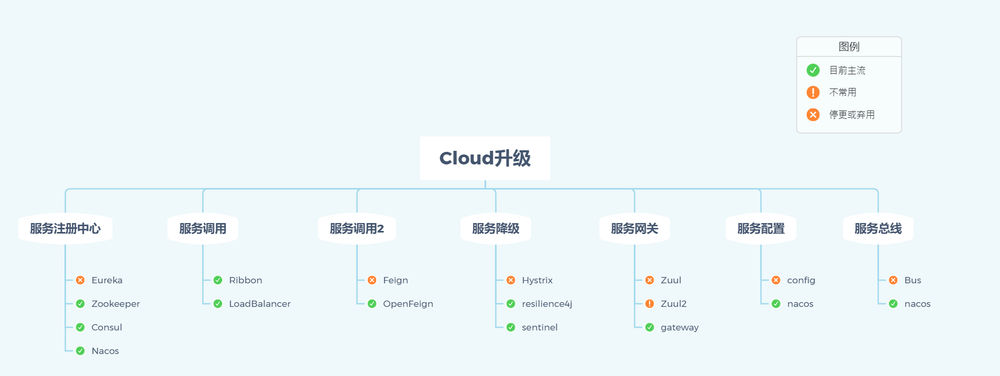

## Spring Cloud学习

### 服务注册和发现（eureka，zookeeper，consul)
- 创建项目 payment8001
- 创建项目 order80
  - RestTemplate 使用
- 创建项目 eureka-server7001
  - 引入eureka
  - eureka-server7001为注册中心
  - payment8001 order80注册为客户端
- 创建项目 eureka-server7002
  - eureka集群 负载均衡（@LoadBalanced）和故障容错 （互相注册，相互守望）
  - 支付微服务集群配置
  - 自我保护 不会轻易删除服务
- 创建项目 payment8003
  - Zookeeper 代替 Eureka
  - Zookeeper在服务器上 节点是临时性的，不像eureka
- 创建项目 zookeeper_order80
  - 创建服务消费者
- 创建项目 payment8005
  - 服务提供者，步骤和zookeeper一样
- 创建项目 consul_order80
  - 创建服务消费者，步骤和zookeeper一样
  
### 服务调用
- 使用Ribbon
  - spring-cloud-starter-netflix-eureka-client带有ribbon的依赖包
  - 负载均衡的规则（7种）
  - 轮询的原理： reset接口第几次请求数 % 服务器集群的总数量 = 实际调用服务器位置下标，每次服务重启后rest接口计数从1开始。
- 使用Feign
  - 是一个声明式的web服务客户端，让编写web服务客户端变得非常容易，只需创建一个接口并在接口上添加注解即可
  - 创建openfeign_order80服务
  - 将微服务变成一个接口 @FeignClient(value="微服务名称")
  - 自带负载均衡机制
  - 超时控制
    - 可以设置超时控制时间 yml配置
  - 日志增强
    - 提供日志打印
    
### 服务降级
- 使用Hystrix
  - 服务降级（服务调用失败的处理方法）、服务熔断（达到最大服务访问后，直接拒绝访问，然后调用服务降级方法）、接近实时的监控
  - 服务降级
    - 服务降级 客户端和服务端都可以做
    - 全局服务降级（@DefaultProperties(defaultFallback = "")）  通用和定制
    -服务熔断
    - 正常 -> 多次错误 -> 关闭 -> 正确率上升 -> 恢复
  - 服务监控hystrixDashboard
    - 监控服务的运行情况

### 服务网关
  - zuul路由网关
  - Gateway新一代网关
    - 路由（构成网关的基本模块，它由ID，目标URI，一系列的断言和过滤器组成），断言，过滤
    - 工作流程：客户端想gateway发出请求，然后在gateway handler mapping中找到与请求相匹配的路由，将其发送到gateway web handler.
               handler再通过指定的过滤器来将请求发送到我们实际的服务执行业务逻辑，然后返回。
               过滤器之间用虚线分开是因为过滤器可能会再发送请求之前（pre）或之后（post）执行业务逻辑
  - 创建项目gateway9527
    - 需要移除spring-boot-starter-web依赖
    - 主要是配置application.yml
    - 路由配置的两种方式（yml文件或者代码配置）
    - 动态路由配置
    - postman(图形化请求) curl(命令请求方式 curl http://localhost:9527/payment/lb --cookie [cookie] -H [请求头])
    - 断言类型，包含时间 cookie 请求头 请求方法等
    - 

### 服务配置
  - 每个微服务都需要一个配置文件，所以建立一个config server来管理配置
  - SpringCloud Config分为服务端和客户端两部分，与GitHub整合
  - bootstrap.yml
  - 创建项目config-center3344 Config配置总控中心搭建
  - 创建项目config-client3355 Config配置客户端搭建
  - Config动态刷新
    - 需要手动执行 curl -X POST "http://localhost:3355/actuator/refresh"

### 消息总线
  - SpringCloud Bus 支持两种消息代理 RabbitMQ 和 Kafka
  - 消息总线RabbitMQ实现动态刷新配置
    - 3344 3355 3366修改
    - 广播通知
      - 刷新服务端 curl -X POST "http://localhost:3344/actuator/bus-refresh"
    - 定点通知
      - 指定具体某个实例生效而不是全部（实例，只通知3355，不通知3366）
      - curl -X POST "http://localhost:3344/actuator/bus-refresh/config-client:3355"
  - Cloud Stream
    - 屏蔽底层消息中间减的差异，降低切换成本，统一消息的编程模型

## restful 调试
> http://localhost:8001/payment/get/1
> eureka测试
> http://eureka7001.com:7001/
> 消费端测试
> http://localhost/consumer/payment/get/1
> zookeeper测试
> http://localhost:8003/payment/zk
> 网关过滤器测试
> http://localhost:9527/payment/lb?username=22
> 服务配置
> http://localhost:3344/master/config-dev.yml